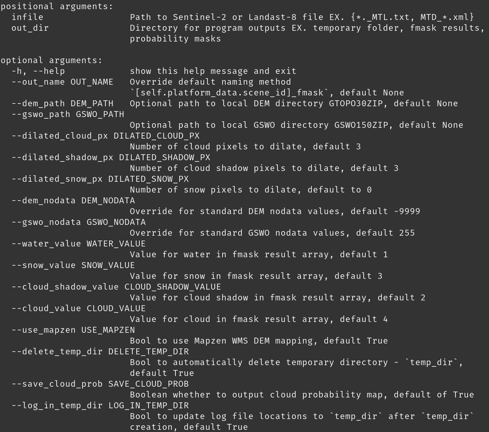

# PyFMask4.3

The definitive Python implementation of FMask 4.3 for Landsat 8 and Sentinel 2. Uses Mapzen DEM WMS for improved detection. Can also use local DEM and GSWO files.

## Installation

This program uses `poetry` for package management. Note, `GDAL` **is** required but not listed in the `pyproject.toml` due to build limitations on pypi. `GDAL` must be installed in the runtime environment.

### Build and install from source

- Ensure poetry is installed

- Navigate to the directory containing `pyproject.toml`

- `poetry install`

- `poetry build`

Follow steps for **Install from pre-built `.whl`** to install the project locally

**or**

The `pyfmask` script configured within poetry allows for simple CLI access without installation

- `poetry run pyfmask [ARGS]`

### Install from pre-built '.whl'

Although this package is not listed on PyPi due to project restrictions, we can achieve the same function result from distributing the project `.whl`s and installing locally through pip/pipx/etc.

- `pip install path/to/.whl`

Now, `pyfmask` is fully installed and accessible anywhere in the installed env

### Use without installation

- As shown in `example.ipynb`, you can import `PFmask` from `pyfmask` from a file in the same root directory

## Usage

### CLI

```shell
pyfmask [ARGS]
```

<p align="center">
    
</p>

### Object

```python
from pyfmask import Fmask

infile: str = "path/to/infile/{*._MTL.txt, MTD_*.xml}"
outfile_dir: str = "path/to/outfile/dir"

control = FMask(infile=infile, out_dir=outfile_dir, auto_save=True, auto_run=True)
```

## FMask Object Docstring

Control object for FMask operations

```markdown
Control object for FMask operations

After executing the `run()` method on instance object, generates 
fmask `results` array with the following default values:

Water - 1
Cloud Shadow - 2
Snow - 3
Cloud - 4
No Data - 255

These values can be overridden, see attributes below. 

Attributes
----------

`infile` : Union[Path, str]
    Path to Sentinel-2 or Landast-8 file EX. {*._MTL.txt, MTD_*.xml}
`out_dir`: Union[Path, str]
    Directory for program outputs EX. temporary folder, fmask results, probability masks
`out_name`: Optional[str]
    Override default naming method `{self.platform_data.scene_id}_fmask`, default None
`gswo_path`: Optional[Union[Path, str]]
    Optional path to local GSWO directory, default None
`dem_path`: Optional[Union[Path, str]]
    Optional path to local DEM directory, default None
    Must be given for DEM operations if `use_mapzen` is False
`dilated_cloud_px`: int
    Number of cloud pixels to dilate, default 3
`dilated_shadow_px`: int
    Number of cloud shadow pixels to dilate, default 3
`dilated_snow_px`: int
    Number of snow pixels to dilate, default to 0
`dem_nodata`: Union[float, int]
    Override for standard DEM nodata values, default -9999
`gswo_nodata`: Union[float, int]
    Override for standard GSWO nodata values, default 255
`water_value`: int
    Value for water in fmask result array, default 1
`snow_value`: int
    Value for snow in fmask result array, default 3
`cloud_shadow_value`: int
    Value for cloud shadow in fmask result array, default 2
`cloud_value`: int
    Value for cloud in fmask result array, default 4
`use_mapzen`: bool
    Bool to use Mapzen WMS DEM mapping, default True
    If false, `dem_path` must be given to use DEM operations
`auto_run`: bool
    Bool to automatically run `cls.run()` method on object init, default False
`auto_save`: bool
    Bool to automatically save fmask `results` array after `run()` completion, default True
`delete_temp_dir`: bool
    Bool to automatically delete temporary directory - `temp_dir` - after `run()`, default True
`save_cloud_prob`: bool
    Bool to save cloud probability array with fmask results, default True
`log_in_temp_dir`: bool
    Bool to update log file locations to `temp_dir` after `temp_dir` creation, default True
    Will result in logfile loss for all log statements before `temp_dir` creation

Properties
-------
`outfile_path` : str
    Full outfile path for fmask results - `out_dir` / `out_name`
    Uses `self.platform_data.scene_id` if `out_name` is None

`temp_dirname` : str
    Full path to temporary directory - `self.platform_data.scene_id` + '_temp'

Methods
-------
`run()`
    Run fmask routine. Generates np.ndarray array `self.results` with value code as described with attributes `water_value`, `snow_value`, `cloud_shadow_value`, `cloud_value`
`save_results()`
    Save `self.results` to `outfile_path` property
`save_array_to_file(array: np.ndarray, file_path: str)`
    Save `array` to `file_path` using `self.platform_info` raster parameters


Example
-------
>>> from pyfmask import FMask

>>> # required arguments
>>> infile: str = "path/to/landsat/or/sentinel/file" # {*._MTL.txt, MTD_*.xml}
>>> out_dir: str = "path/to/desired/out/dir"

>>> ## Example 1
>>> #  No local GSWO or DEM. Using Mapzen WMS DEM. Auto-generated name based on scene id
>>> ##
>>> controller = FMask(infile=infile, out_dir=out_dir)
>>> controller.run() # manually run unless arg `auto_run` is True
>>> controller.save_results() # manually save unless arg `auto_save` is True

>>> ## Example 2
>>> #  Using local GSWO and DEM (no mapzen)
>>> ##
>>> dem_path: str = "path/to/local/dem/GTOPO30ZIP"
>>> gswo_path: str = "path/to/local/gswo/GSWO150ZIP"
>>> controller = FMask(infile=infile, out_dir=out_dir, gswo_path=gswo_path, 
    dem_path=dem_path, use_mapzen=False, auto_run=True, auto_save=True)


>>> ## Example 3
>>> #  Override default name & don't auto-delete `temp_dir`
>>> ##
>>> out_file_name: str = "example_file.tif"
>>> controller = FMask(infile=infile, out_dir=out_dir, delete_temp_dir=False,
    out_name=out_file_name, auto_run=True, auto_save=True)
```
